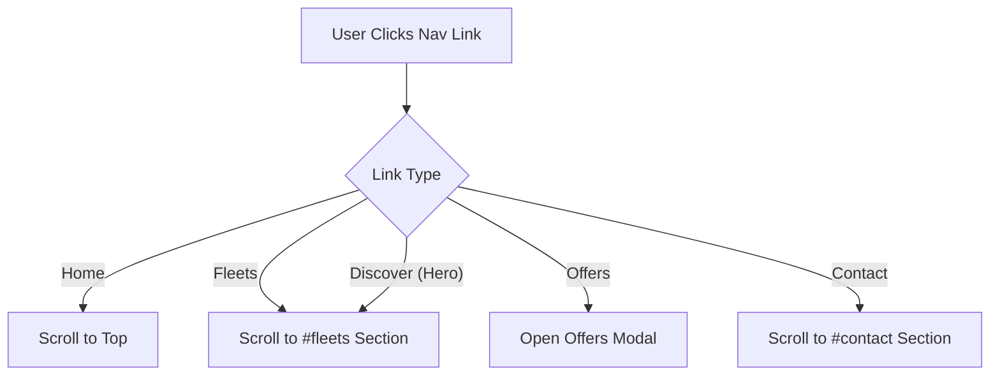
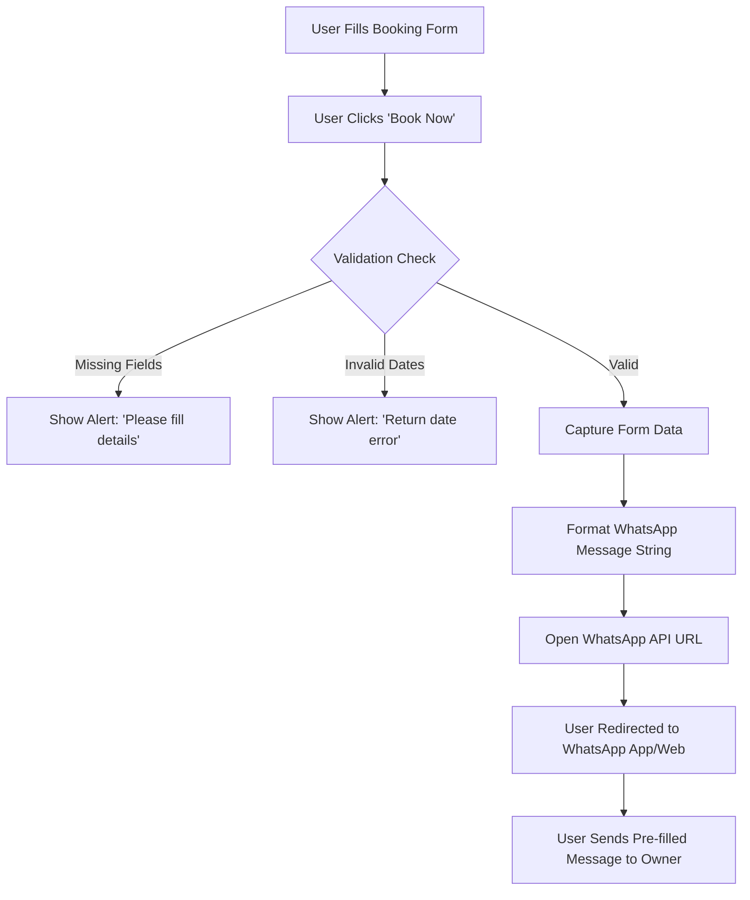
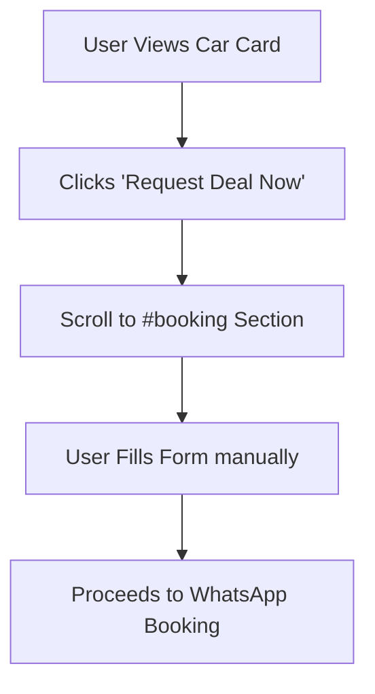
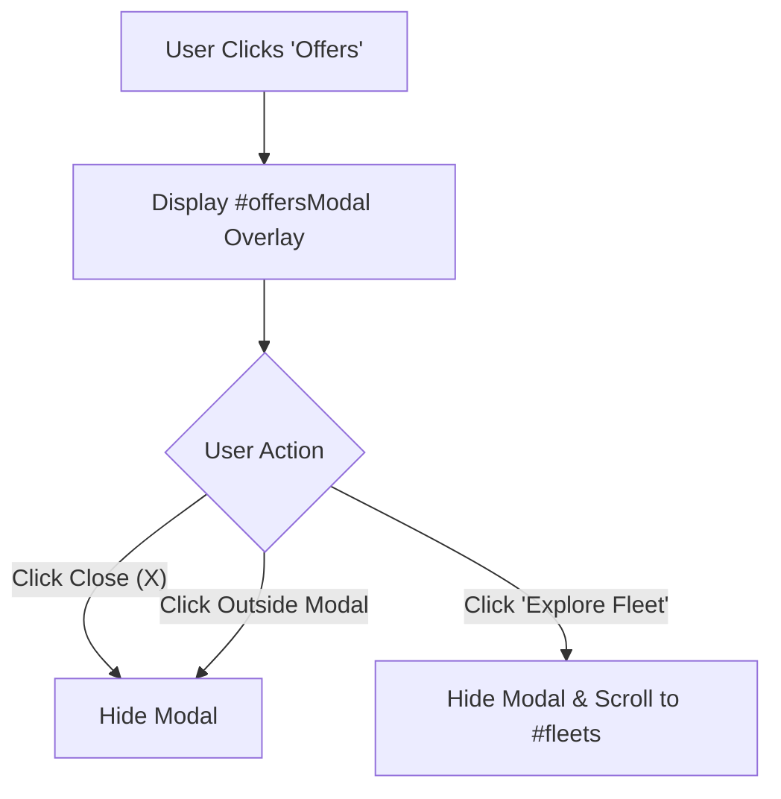
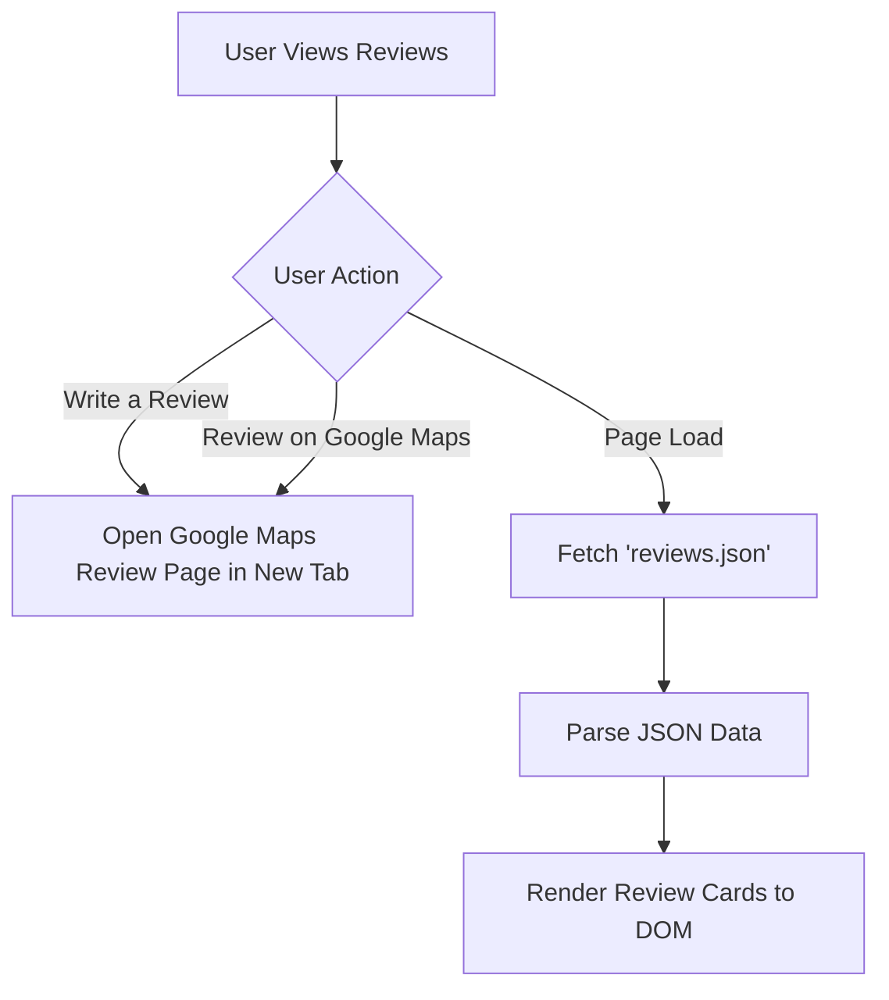
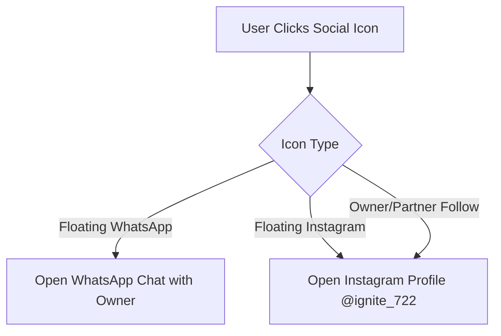

# Ignite Wheels - Premium Car Rental Platform Documentation

## 1. Project Overview
**Ignite Wheels** is a premium self-drive car rental platform based in Srikakulam, Andhra Pradesh. The website serves as a digital storefront allowing users to browse the vehicle fleet, check pricing, and initiate bookings directly via WhatsApp. The design emphasizes luxury, ease of use, and direct communication with the business owner.

---

## 2. Design System & Aesthetics
The website utilizes a **Dark Mode** aesthetic with high-contrast accents to convey a premium feel.

*   **Primary Colors:**
    *   Background: `Black (#000000)` & `Dark Gray (#0a0a0a)`
    *   Accents: `Gold (#C5A059)` & `Red (#D2042D)`
    *   Text: `White (#ffffff)` & `Light Gray (#b0b0b0)`
*   **Typography:** `Poppins` (Google Fonts) - Weights: 300, 400, 600, 700, 800.
*   **Visual Effects:**
    *   **Glassmorphism:** Semi-transparent backgrounds with blur effects (`backdrop-filter: blur(10px)`).
    *   **Gradients:** Animated text gradients and borders using Gold/Red/White.
    *   **Animations:** Floating elements, hover lifts, and infinite scrolling tracks.

---

## 3. Data & Content Structure

### 3.1. Data Sources
*   **Static Data (HTML):** Fleet details (Car names, prices, specs), Owner info, Partner info.
*   **Dynamic Data (JSON):** Client reviews are loaded asynchronously from `assets/data/reviews.json`.
*   **External Assets:** Font Awesome icons, Google Fonts, Google Maps Embed.

### 3.2. Page Structure (Header to Footer)

#### **A. Header (Fixed)**
*   **Logo:** "Ignite Wheels" (Image).
*   **Navigation:** Links to Home, Fleets, Offers, Contact.
*   **Mobile Menu:** Hamburger icon toggles a full-screen overlay menu.

#### **B. Hero Section**
*   **Background:** Autoplay video (`vehicle video 1.mp4`) with overlay.
*   **Content:** Animated "IGNITE WHEELS" title, subtitle.
*   **Call to Action:** "DISCOVER" button scrolls to the Fleet section.

#### **C. Booking Engine**
*   **Form Fields:** Name, Phone, Email, Pickup Location (Srikakulam), Vehicle Type, Dates, Duration, Driver Option.
*   **Logic:** Collects user input and formats a pre-filled WhatsApp message.

#### **D. Image Slider**
*   **Style:** Infinite horizontal scroll (Flipkart style).
*   **Content:** Promotional images of vehicles.

#### **E. How It Works**
*   **Steps:** 6-step process (Choose Location -> Pick Date -> Book Car -> Make Payment -> Enjoy Trip -> Return Car).
*   **Visuals:** Numbered cards with icons.

#### **F. Fleet Showcase (Best Selling Models)**
*   **Layout:** Grid of "Offer Cards".
*   **Card Content:** Car Image, Name, Price/12hr, Specs (Seats, Bags, Doors, AC), Features (Unlimited km), "Request Deal Now" button.
*   **Lazy Loading:** Images use `loading="lazy"` for performance.

#### **G. Stats & Brands**
*   **Stats:** Counters for Happy Clients, Cars, Years, Ratings.
*   **Brands:** Infinite scrolling marquee of car brand logos (Suzuki, Mahindra, etc.).

#### **H. Owner & Partner Section**
*   **Owner Card:** Profile of Asif Mohammed (Founder) with contact details.
*   **Instagram Card:** Profile preview for `@ignite_722` with "Follow" button.
*   **WhatsApp Box:** Large CTA to book directly via WhatsApp.
*   **Partner Section:** Profile for Digital Marketing Partner (`urs_.subbu`).

#### **I. Reviews Section**
*   **Grid:** Dynamically populated review cards.
*   **Actions:** "Write a Review" (Links to Google Maps), "Review on Google Maps".

#### **J. Footer**
*   **Top:** Contact details (Address, Phone, Email) & Embedded Google Map.
*   **Bottom:** Quick links, Social icons, Copyright info.

---

## 4. User Flows & Button Logic

### 4.1. Navigation Flow
Users navigate the single-page application using anchor links.



### 4.2. Booking Process (WhatsApp Integration)
The core functionality of the site is the direct-to-WhatsApp booking engine.



### 4.3. Fleet "Request Deal" Flow
Each car card has a specific call to action.



### 4.4. Offers Modal Logic
Triggered from the Header or Footer "Offers" link.



### 4.5. Review System Flow
Handling user feedback.



### 4.6. Social Media Interactions
Floating icons and profile buttons.



---

## 5. Technical Implementation Details

### Performance Optimizations
*   **Lazy Loading:** `loading="lazy"` attribute applied to all off-screen images (Fleet, Owner, Footer) to reduce initial load time.
*   **Non-Blocking CSS:** Font Awesome loaded with `media="print" onload="this.media='all'"` to prevent render blocking.
*   **Explicit Dimensions:** `width` and `height` attributes added to images to prevent Cumulative Layout Shift (CLS).

### JavaScript Functions
*   `sendToWhatsapp()`: Gathers form data, validates inputs, constructs the URL-encoded message, and opens the `wa.me` link.
*   `loadReviews()`: Async function that fetches `reviews.json` and appends HTML cards to the DOM.
*   `updateStars()`: Visual logic for the star rating input in the (hidden) manual review modal.
*   `Sticky Header`: Toggles `.scrolled` class on the navbar based on `window.scrollY`.

---

## 6. File Structure
```
ignite wheels/
├── assets/
│   ├── css/
│   │   └── style.css       # (Optional/Legacy) Main styles are currently in index.html <style>
│   ├── js/
│   │   ├── script.js       # (Optional/Legacy) External scripts
│   │   └── Main/
│   │       └── index.html  # MAIN ENTRY POINT
│   ├── images/             # Vehicle images, logos, profiles
│   └── data/
│       └── reviews.json    # Client review data
└── README.md               # Original Documentation
└── README_DESIGN.md        # This Design Documentation
```
